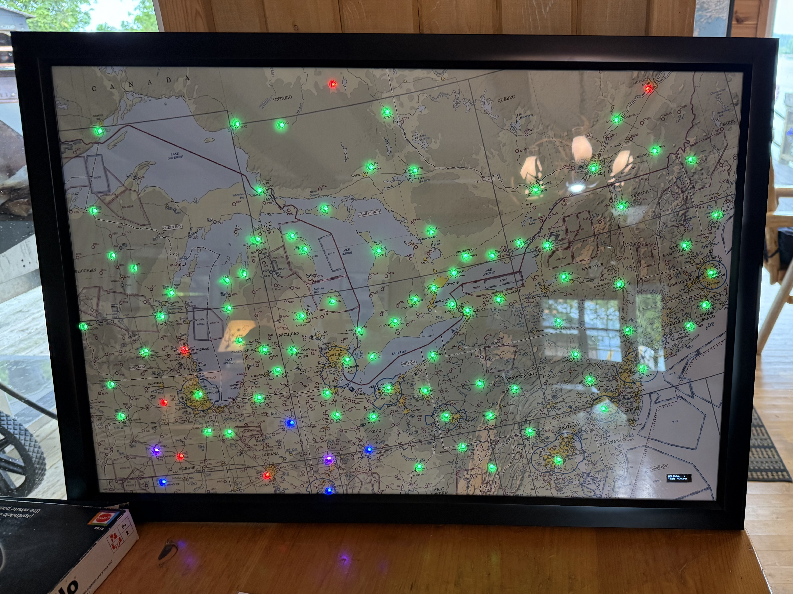
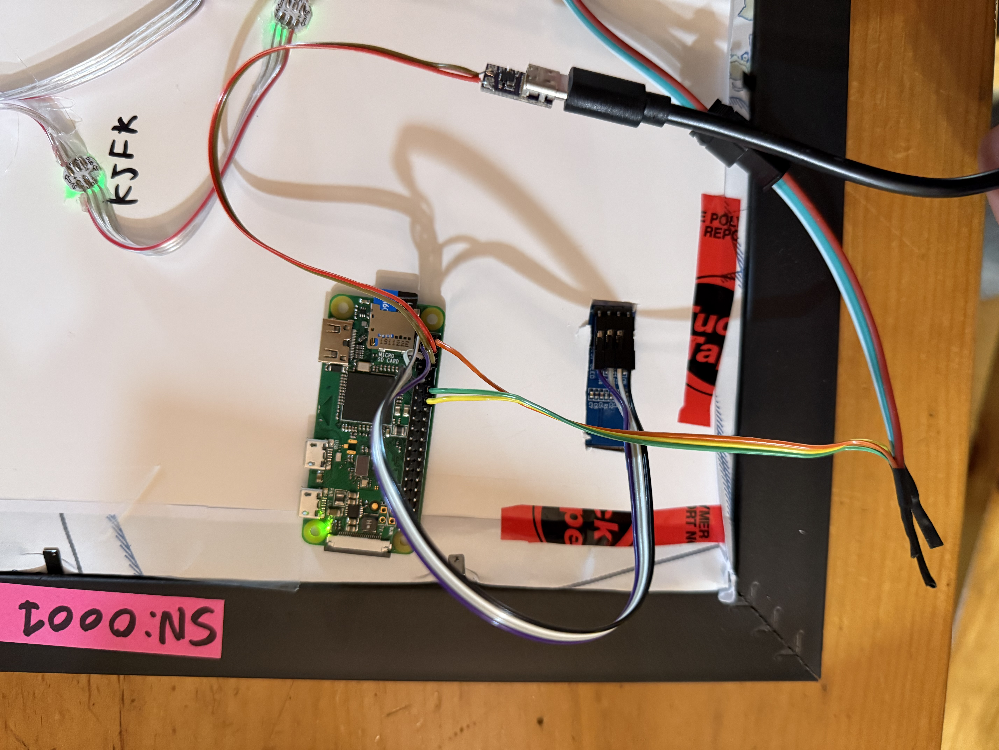

# METAR Map  
A Physical Weather Display Using LEDs





## Overview  
This project displays real-time METAR data (aviation weather reports) on a physical map using RGB LEDs. Each LED corresponds to an airport and changes color based on current flight conditions. This repository contains the software and instructions to build your own METAR Map.

---
## How to Build Your Own

1. **Print the Map** – Choose and print a map of the area you want to display.
2. **Mark and Punch Airports** – Use a hole punch or similar tool to mark each airport you wish to light up.
3. **Install LEDs** – Wire a WS2812 LED to each airport hole, keeping track of the LED order (important for configuration).
4. **Prepare Software** – Follow the setup instructions below.
5. **Connect Hardware** – Wire the LEDs and optional display to a Raspberry Pi.
6. **Test Airport Order** – Use built-in tools to verify each LED location.
7. **Adjust Colors & Brightness** – Tune color and brightness as needed.
8. **Mount and Display** – Install in a frame and mount on the wall.

Note: See images/ directory for pictures of the assembly

---

## Required Materials

- Large printed map
- Foam board for backing
- Picture frame (sized to match the foam board)
- **Raspberry Pi** (with Wi-Fi; e.g., Raspberry Pi Zero W)
- **WS2812 (Neopixel-style) LED string**  
  - [Option 1](https://www.aliexpress.com/item/4000834629132.html)  
  - [Option 2](https://www.aliexpress.com/item/1005005594083059.html)
- **5V power supply** – USB-C breakout recommended (some soldering required):  
  [USB-C Power Adapter](https://www.aliexpress.com/item/1005005210319873.html)
- **OLED Display (SSD1306, 128x32, I2C):**  
  [Link](https://www.aliexpress.com/item/1005006943524145.html)
- Wires, solder, heat shrink, tools, etc.

---
## Hardware Wiring

Refer to [pinout.xyz](https://pinout.xyz/) for Raspberry Pi GPIO details.

| RPi Pin | Function         | Connects To                  |
|---------|------------------|------------------------------|
| 1       | 3.3V Power       | OLED Display VCC             |
| 2       | 5V Power         | LED Power                    |
| 3       | I2C SDA          | OLED SDA                     |
| 4       | 5V Power         | From 5V USB Power Supply     |
| 5       | I2C SCL          | OLED SCL                     |
| 6       | GND              | Power Supply Ground          |
| 8       | UART TX          | Optional Debug Console       |
| 10      | UART RX          | Optional Debug Console       |
| 12      | GPIO - LED Data  | LED Data Line                |
| 14      | GND              | LED Ground                   |



---


## Software Setup


> **Note:** This script must be installed and run as the `root` user to access GPIO.  
> Start by entering:
> ```bash
> sudo su
> ```

### 1. Prepare Raspberry Pi  
Ensure the Pi is connected to Wi-Fi. `nmcli` is recommended over `wpa_supplicant` for easier setup.

Install required packages:
```bash
sudo apt update
sudo apt install git python3-pip
```

### 2. Clone the Rpository
Clone the repository into /root:
```bash
cd /root
git clone https://github.com/puregame/metarmap.git
```

### 3. Set Up Python Virtual Environment
Create and activate a virtual environment:

```bash
python3 -m venv venv
source venv/bin/activate
```

### 4. Install Python Dependencies
Navigate to the project folder and install required packages:

```bash
cd metarmap
pip install -r requirements.txt
```

### 5. Configure the Systemd Service
Copy the included service file:

```bash
cp metarmap.service /etc/systemd/system/

```

Reload systemd and enable the service:
```bash
systemctl daemon-reexec
systemctl daemon-reload
systemctl enable metarmap.service
```

### 6. Start and Check the Service
Start the service and view its status:

```bash
systemctl start metarmap.service
systemctl status metarmap.service
```
To stop the service:
```bash
systemctl stop metarmap.service

```

## Running Manually
If you prefer to run the script manually (for testing or debugging), make sure to stop the systemd service first:
```bash
systemctl stop metarmap.service
```
Then run the script:

```bash
sudo su
source /root/venv/bin/activate
python3 /root/metarmap/runmap.py

```


## Logging
- logs are written to metar_led.log
- The latest METAR data is cached in: `latest_metars.json`

## Updating
To update the code from the GitHub repository:

```bash
sudo su
sudo systemctl stop metarmap.service
cd /root/metarmap
git pull
sudo systemctl start metarmap.service
```

---

## Configuration

Configuration is managed via a file called `config.json` in the project folder.  
You can use the `serial_number` field to uniquely identify which config file belongs to which physical map.

### Airports

- The `airports` array must match the physical order of the LEDs — typically closest to farthest from the Pi.
- If you add more airports, be sure to update the `num_leds` field to reflect the total number.

### Color Configuration

- The software provides default color mappings for flight conditions (VFR, MVFR, IFR, etc.).
- You can override these in the `config.json` file by defining a `color_map` and/or `dim_color_map`.
- Some LEDs (e.g., WS2810) may use GBR instead of RGB format — adjust the color order in the config if needed.

### Home Airport

- The `home_airport` field is used to determine local day or night using sunrise/sunset times.
- When it's night at the home airport, the `dim_colors` are used instead of the default colors to reduce brightness.

---

## Debugging
For optional arguments list
```bash
python3 runmap.py --help
```

### Check LED–Airport Mappings
After assembling the map, verify the LED-to-airport order using:

```bash
python3 runmap.py --cycle_airports
```

This command:
- Lights one LED at a time in red.
- Displays the LED index and corresponding airport ID on the screen.


### Test LED Intensity and Color Accuracy
To test brightness and color mapping, run:

```bash
python3 runmap.py --test_displays
```
This will light up the 10 closest LEDs in the following order:

- High-intensity: VFR, MVFR, IFR, LIFR, UNK
- Low-intensity: VFR, MVFR, IFR, LIFR, UNK

Use this test to tune brightness and verify correct color configuration.


# Future Ideas:
- Flash LEDs for airports where lightning or TCUs are present