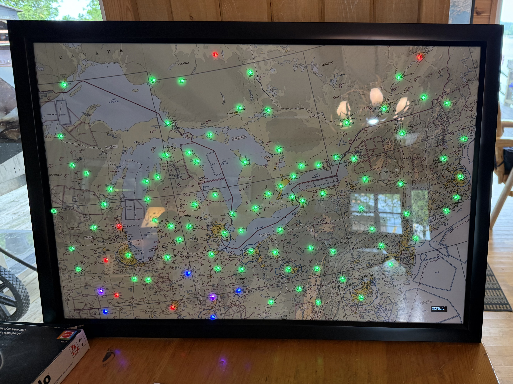
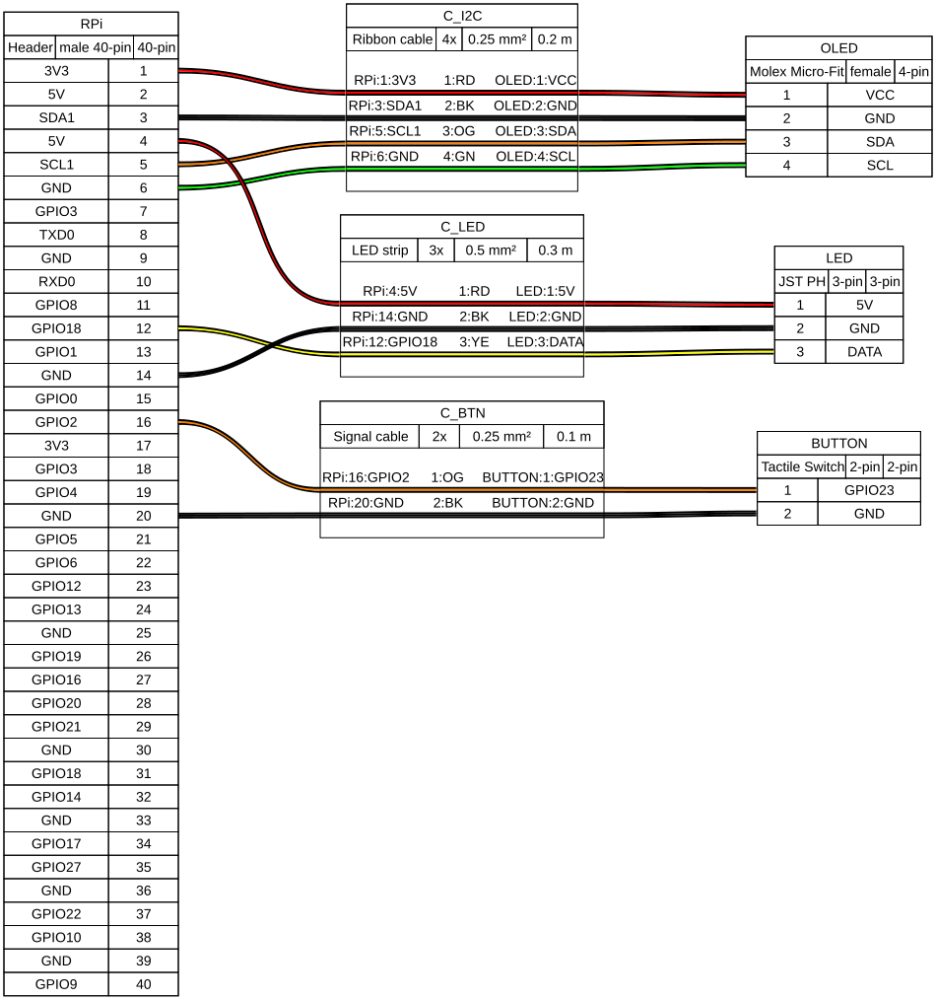
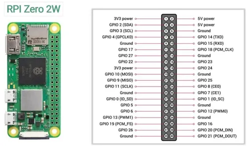
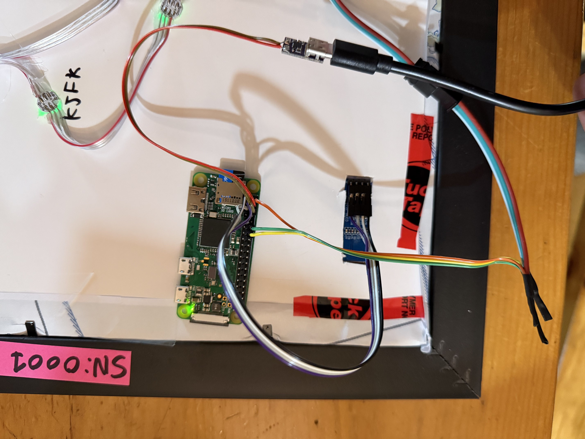

# METAR Map  
A Physical Weather Display Using LEDs





## Overview  
This project displays real-time METAR data (aviation weather reports) on a physical map using RGB LEDs. Each LED corresponds to an airport and changes color based on current flight conditions. This repository contains the software and instructions to build your own METAR Map.

---

## Quick Start

### 1. Flash Raspberry Pi OS to your Pi

Download and install [Raspberry Pi Imager](https://www.raspberrypi.com/software/). Flash **Raspberry Pi OS Lite (64-bit, Bookworm)** to your SD card. In the Imager settings, pre-configure your Wi-Fi credentials and enable SSH.

> **Minimum OS:** Raspberry Pi OS **Bookworm** (Debian 12, October 2023 or later). The Wi-Fi AP hotspot feature requires NetworkManager, which became the default in Bookworm. Older releases (Bullseye, etc.) are not supported.

### 2. Boot your Pi and SSH in

Insert the SD card, power on the Pi, and SSH in once it appears on your network:

```bash
ssh pi@<your-pi-ip>
```

> **Tip:** If you set a hostname in Raspberry Pi Imager (e.g., `metarmap`), you can use `ssh pi@metarmap.local` instead of finding the IP address. mDNS (`.local`) works out of the box on Mac and most Linux systems; Windows users may need [Bonjour](https://support.apple.com/downloads/bonjour-for-windows) installed.

Switch to root and go to the home directory:

```bash
sudo su
cd ~
```

### 3. Install Git

```bash
apt update
apt install -y git
```

### 4. Clone the repository

```bash
git clone https://github.com/puregame/metarmap.git
```

### 5. Run the setup script

```bash
bash metarmap/setup.sh
```

> **Note:** `setup.sh` installs all dependencies, configures the Python environment, enables I2C, and sets up the systemd service to run automatically on boot.

<!-- TODO: Add screenshot of setup script running in terminal -->

### 6. Open the web interface and configure your LEDs

Once the setup script completes, the MetarMap service starts automatically. Open a browser and navigate to:

```
http://<your-pi-ip>:8080
```

Use the **Config** tab to assign an airport code to each LED. Click **Flash** to identify which physical LED each row corresponds to, enter the airport ICAO code, then click **Save All Config**.

<!-- TODO: Add screenshot of web UI Config tab -->

### 7. Profit

Your map should now be live. LEDs will update with real-time METAR flight conditions automatically.

<!-- TODO: Add photo of completed map on the wall -->

---

## How to Build Your Own

1. **Print the Map** – Choose and print a map of the area you want to display.
2. **Mark and Punch Airports** – Use a hole punch or similar tool to mark each airport you wish to light up.
3. **Install LEDs** – Wire a WS2812 LED to each airport hole, keeping track of the LED order (important for configuration).
4. **Prepare Software** – Follow the Quick Start instructions above.
5. **Connect Hardware** – Wire the LEDs and optional display to a Raspberry Pi.
6. **Test Airport Order** – Use the web UI's Config tab to map each LED to an airport.
7. **Adjust Colors & Brightness** – Tune color and brightness via `config.json` as needed.
8. **Mount and Display** – Install in a frame and mount on the wall.

Note: See [images/](images/) directory for pictures of the assembly.

---

## Required Materials

- Large printed map
- Foam board for backing
- Picture frame (sized to match the foam board)
- **Raspberry Pi** (with Wi-Fi; e.g., Raspberry Pi Zero W)
- **WS2812 (Neopixel-style) LED string**  
  - [Option 1](https://www.aliexpress.com/item/4000834629132.html)  
  - [Option 2](https://www.aliexpress.com/item/1005005594083059.html)
- **5V power supply** – USB-C breakout recommended (some soldering required):  
  [USB-C Power Adapter](https://www.aliexpress.com/item/1005005210319873.html)
- **OLED Display (SSD1306, 128x32, I2C):**  
  [Link](https://www.aliexpress.com/item/1005006943524145.html)
- Wires, solder, heat shrink, tools, etc.

---

## Hardware Wiring

The diagram below shows the complete wiring from the Raspberry Pi GPIO header to the OLED display and LED strip.

| | |
|---|---|
|  |  |
| MetarMap Wiring Diagram | RPi 40-pin GPIO Pinout |

For full GPIO pin details, refer to [pinout.xyz](https://pinout.xyz/).

### Quick Reference

| RPi Pin | Function         | Connects To                  |
|---------|------------------|------------------------------|
| 1       | 3.3V Power       | OLED Display VCC             |
| 3       | I2C SDA          | OLED SDA                     |
| 4       | 5V Power         | LED Strip 5V                 |
| 5       | I2C SCL          | OLED SCL                     |
| 6       | GND              | OLED GND                     |
| 12      | GPIO18           | LED Strip DATA               |
| 14      | GND              | LED Strip GND                |
| 16      | GPIO23           | Button (pull-up)             |
| 20      | GND              | Button                       |



---


## Software Setup (Detailed)

> The [Quick Start](#quick-start) above covers the most common path. This section documents each step individually for troubleshooting or manual setup.

> **Note:** The software must be installed and run as the `root` user to access GPIO.  
> Always start by entering:
> ```bash
> sudo su
> ```

### 1. Prepare Raspberry Pi

Ensure the Pi is connected to Wi-Fi. `nmcli` is recommended for easier setup (see [tutorial](https://www.jeffgeerling.com/blog/2023/nmcli-wifi-on-raspberry-pi-os-12-bookworm/)).

Install required packages:
```bash
apt update
apt install -y git python3-pip libjpeg-dev zlib1g-dev libfreetype6-dev dnsmasq
```

> **Note:** `dnsmasq` is used by NetworkManager to provide DHCP when the Pi broadcasts a setup Wi-Fi hotspot (AP mode). It is not needed if you configure Wi-Fi manually before first boot.

### 2. Clone the Repository

```bash
cd /root
git clone https://github.com/puregame/metarmap.git
```

### 3. Enable I2C Interface

```bash
raspi-config
```
Browse to Interfacing Options > I2C > Enable

Optional: check I2C connection
```bash
apt install -y i2c-tools
i2cdetect -y 1
```

### 4. Set Up Python Virtual Environment

```bash
python3 -m venv venv
source venv/bin/activate
```

### 5. Install Python Dependencies

```bash
cd metarmap
pip install -r requirements.txt
```

### 6. Configure the Systemd Service

```bash
cp metarmap.service /etc/systemd/system/
systemctl daemon-reexec
systemctl daemon-reload
systemctl enable metarmap.service
```

### 7. Start and Check the Service

```bash
systemctl start metarmap.service
systemctl status metarmap.service
```

To stop the service:
```bash
systemctl stop metarmap.service
```

---

## Running Manually

Stop the systemd service first, then run directly:

```bash
systemctl stop metarmap.service
source /root/venv/bin/activate
python3 /root/metarmap/runmap.py
```

---

## Logging

- Logs are written to `metar_led.log`
- The latest METAR data is cached in `latest_metars.json`

---

## Updating

```bash
sudo su
systemctl stop metarmap.service
cd /root/metarmap
git update-index --assume-unchanged config.json
git pull
systemctl start metarmap.service
```

> **Important:** Always run `git update-index --assume-unchanged config.json` before pulling, otherwise your airport configuration will be overwritten.

---

## Web Interface

The web UI is the primary way to configure and monitor your MetarMap. Open `http://<pi-ip>:8080` in a browser.

If running manually, start the web server with the `--web` flag:

```bash
python3 runmap.py --web
```

### Status Panel

Displays current system information:
- Number of airports configured
- Home airport
- Timezone
- Last METAR report time
- IP address
- Total LED count

### LED Configuration (Config Tab)

Each LED position maps to an airport ICAO code. Leave an entry blank or use `NONE` to keep that LED off. Click **Flash** to identify the physical LED, enter the airport code, then click **Save All Config** to persist to `config.json`.

<!-- TODO: Add screenshot of web UI Config tab with annotated callouts -->

### API Endpoints

| Method | Path | Description |
|--------|------|-------------|
| GET | `/` | Web UI (HTML page) |
| GET | `/api/status` | System status JSON |
| GET | `/api/config` | Current config.json contents |
| GET | `/api/debug` | Night mode diagnostics |
| GET | `/api/logs?lines=N` | Last N log lines |
| POST | `/api/leds/clear` | Turn off all LEDs |
| POST | `/api/leds/{n}/flash` | Flash LED n white 3 times |
| POST | `/api/config` | Save config (POST JSON body) |
| POST | `/api/refresh` | Force immediate METAR refresh |
| POST | `/api/leds/test` | Test all day/night LED colors |

#### API Response Examples

**GET /api/status**
```json
{
  "airports": ["CYYZ", "CYTZ", "CYOW"],
  "home": "CYYZ",
  "timezone": "America/Toronto",
  "last_metar": "2025-01-15T14:30:00+00:00",
  "ip_address": "192.168.1.100",
  "led_count": 100,
  "categories": {"CYYZ": "VFR", "CYTZ": "MVFR"},
  "is_night": false,
  "category_colors": {"VFR": "#008c00"},
  "category_colors_dim": {"VFR": "#002d00"}
}
```

**POST /api/config**
```json
// Request body
{
  "airports": ["CYYZ", "CYTZ", "NONE", "CYOW"],
  "home": "CYYZ",
  "num_leds": 100,
  "timezone": "America/Toronto",
  "colors": {"VFR": "#00ff00", "MVFR": "#0000ff", "IFR": "#ff0000", "LIFR": "#780050", "UNK": "#646464"},
  "dim_colors": {"VFR": "#00ff00", "MVFR": "#0000ff", "IFR": "#ff0000", "LIFR": "#780050", "UNK": "#646464"}
}

// Response
{"ok": true}
```

---

## Configuration

Configuration is managed via `config.json` in the project folder. The web UI is the recommended way to configure your map — `config.json` is primarily for advanced users or as a backup.

You can use the `serial_number` field to uniquely identify which config file belongs to which physical map.

### Airports

- The `airports` array must match the physical order of the LEDs — typically closest to farthest from the Pi.
- If you add more airports, update the `num_leds` field to match.

### Color Configuration

- Default color mappings are provided for VFR, MVFR, IFR, LIFR, and UNK.
- Override these in `config.json` with a `colors` and/or `dim_colors` object.
- Some LEDs (e.g., WS2810) may use GBR instead of RGB — adjust color order in the config if needed.

### Home Airport

- The `home` field determines local day/night using sunrise/sunset times.
- At night, `dim_colors` are used instead of `colors` to reduce brightness.

### Timezone

- The `timezone` field sets the local timezone for the OLED display and web UI.
- Uses IANA timezone identifiers (e.g., `America/Toronto`, `America/Vancouver`, `Europe/London`).
- Defaults to UTC if not specified or invalid.

---

## Debugging

List all optional arguments:
```bash
python3 runmap.py --help
```

### Test LED Intensity and Color Accuracy

```bash
python3 runmap.py --test_displays
```

This lights up the 10 closest LEDs in this order:
- High-intensity: VFR, MVFR, IFR, LIFR, UNK
- Low-intensity: VFR, MVFR, IFR, LIFR, UNK

Use this to tune brightness and verify correct color configuration.

---

## Wiring Diagram Source

The wiring diagram is generated from [WireViz](https://github.com/wireviz/WireViz) using `images/wiring.wv.yaml`.

To regenerate:

```bash
pip install wireviz
wireviz images/wiring.wv.yaml
```

---

# Future Ideas
- Flash LEDs for airports where lightning or TCUs are present
